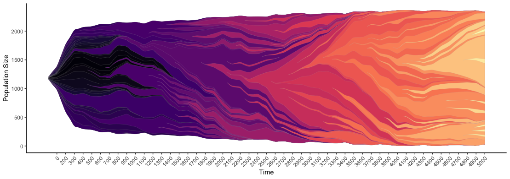

## Tissue structure accelerates evolution: premalignant sweeps precede neutral invasion

This is the open-source code repository for the passenger driver model of tumor evolution. This is a two-dimensional on lattice agent-based model.

## Before you start
TumorEvolution.java uses the open-source agent-based modeling platform called [HAL](http://halloworld.org/). In order to run this code base, you'll need to download the latest version of [Java](http://www.oracle.com/technetwork/java/javase/downloads/jdk9-downloads-3848520.html) and an editor (we suggest using [IntelliJ Idea](https://www.jetbrains.com/idea/download/)).

### Setting up the project in IntelliJ Idea

1. Open Intellij Idea and click "create project from existing sources" ("file/ new/ project from existing sources" from the main GUI) and direct it to the unzipped AgentFramework Source code directory.
2. Continue through the rest of the setup, click next until it asks for the Java SDK:
- "/Library/ Java/ JavaVirtualMachines/" on Mac.
- "C:\ Program Files\ Java\" on Windows.
3. Once the setup is complete we will need to do one more step and add some libraries that allow for 2D and 3D OpenGL visualization:
4. open the Intellij IDEA main gui
5. go to "file/ project structure"
6. click the "libraries" tab
7. use the minus button to remove any pre-existing library setup
8. click the plus button, and direct the file browser to the "Framework/ lib" folder.
9. click apply or ok

### References

1. [Chandler D. Gatenbee, Ryan O. Schenck, Rafael Bravo, Alexander R.A. Anderson. EvoFreq: Visualization of the Evolutionary Frequencies of Sequence and Model Data. 2019. bioRxiv.](https://www.biorxiv.org/content/10.1101/743815v1)

2. [Jeffrey West, Ryan Schenck, Chandler Gatenbee, Mark Robertson-Tessi, Alexander RA Anderson. Tissue structure accelerates evolution: premalignant sweeps precede neutral expansion. 2019. bioRxiv.](https://www.biorxiv.org/content/10.1101/542019v2)

3. [Hybrid Automata Library: A modular platform for efficient hybrid modeling with real-time visualization
Rafael Bravo, Etienne Baratchart, Jeffrey West, Ryan O. Schenck, Anna K. Miller, Jill Gallaher, Chandler D. Gatenbee, David Basanta, Mark Robertson-Tessi, Alexander R. A. Anderson
bioRxiv 411538.](https://www.biorxiv.org/content/10.1101/411538v4)

